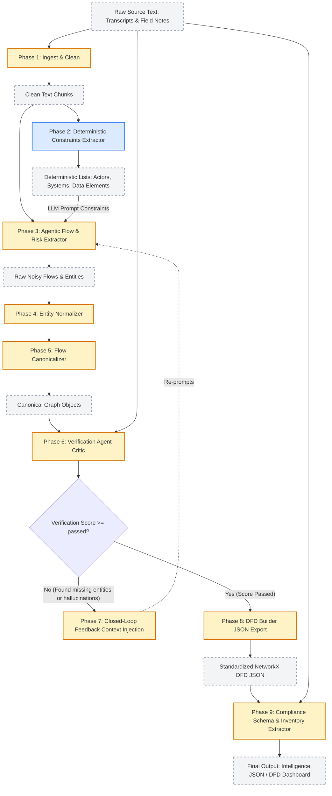

# Document Intelligence Pipeline Architecture

This document describes the flow of the modern, hybrid Deterministic NLP + Agentic AI pipeline used for Privacy Impact Assessments (PIA) and Data Flow Diagram (DFD) generation. 

The pipeline is invoked via:
```bash
python main.py pipeline --files <input_files>
```

## 🗺️ Pipeline Data Flow Diagram



---

## 🚀 The Complete 9-Phase Flow (`pipeline_runner.py`)

The overarching philosophy of this pipeline is **Trust but Verify**. Rather than relying on a single, massive LLM prompt (which leads to hallucinations, missed connections, and token limit exhaustion), the orchestration breaks the problem into a 9-Phase assembly line.

### Phase 1: Ingest & Clean
- **Component**: `detect_document_type`, `CleanTranscripts`, `CleanFieldNotes`
- **Action**: The raw text is analyzed to determine if it's a dialog transcript or structured field notes. It then parses, formats, and segments the text into manageable chunks.
- **Output**: Cleaned text chunks, document metadata, and a starter list of `actors` (speakers or assigned roles).

### Phase 2: Deterministic Extraction (NLP)
- **Component**: `extract_entities`, `extract_systems`, `extract_data_element`, `detect_risks`
- **Action**: Uses hardcoded regex, SpaCy NLP, and keyword heuristics to identify ground-truth entities. We identify names of people, explicit software systems, specific data types (e.g., "SSN", "Email"), and risk keywords.
- **Output**: *Deterministic Lists* of Arrays: `actors`, `systems`, `data_elements`, `risks`.

### Phase 3: Agentic Extraction (LLMs)
- **Component**: `SystemExtractionAgent`, `DataFlowAgent`, `RiskAnalysisAgent`
- **Action**: We invoke Anthropic's Claude to read the chunks, but **crucially**, we inject the *Deterministic Lists* from Phase 2 directly into the system prompts. The agents are instructed to find relationships *between the known entities*, rather than inventing new ones from scratch.
- **Output**: Raw, noisy data flows mapping `source` nodes to `target` nodes, with associated `data_elements`.

### Phase 4: Entity Normalization
- **Component**: `EntityNormalizationAgent`
- **Action**: The LLM might extract "Salesforce", "SFDC", and "Salesforce CRM" as three different systems. This agent deduplicates, merges, and classifies all known actors and systems into canonical identifiers. Lists are consolidated down to unique entities.
- **Output**: Normalized dictionaries of `actors` and `systems`.

### Phase 5: Flow Canonicalization
- **Component**: `FlowCanonicalizerAgent`
- **Action**: The initial flow extraction is highly fragmented (e.g., 50 different flows between the Customer and the System). This agent deterministically merges flows that share the same `source` and `target` into a single canonical edge, aggregating their transfer mechanisms and data elements.
- **Output**: A clean array of canonical `flows` ready for graph rendering.

### Phase 6: Pipeline Verification (The Critic)
- **Component**: `PipelineVerificationAgent`
- **Action**: A specialized, adversarial LLM agent parses the raw source text alongside the finalized JSON pipeline output. It scores the extraction on Completeness (did we miss systems?) and Accuracy (did we hallucinate systems?).
- **Output**: A Verification Report with a confidence score (0.0 to 1.0) and missing/hallucinated items.

### Phase 7: Closed-Loop Feedback & Reprocessing
- **Action**: If the Verification Agent scores the extraction poorly or flags missing systems, the pipeline catches this and triggers an automatic **Feedback Loop**. It re-runs Phase 3 (Agentic Extraction) but injects the *missing context* directly into the prompt (e.g., *"IMPORTANT: Make sure to extract flows for Ameyo."*).
- **Execution Limit**: It will attempt this up to `MAX_REPROCESS_ATTEMPTS` (currently 2).

### Phase 8: Final DFD Graph Building
- **Component**: `DFDBuilderAgent`
- **Action**: Translates the normalized nodes and canonical flows into our standard `DataFlowGraph` NetworkX format.
- **Output**: The finalized layout-ready JSON for the HTML Generator.

### Phase 9: Compliance Schema & Data Inventory
- **Component**: `SchemaGeneratorAgent`
- **Action**: A final LLM pass that re-reads the source text against the proven, verified graph nodes, attaching deep compliance metadata (Classification, Legal Basis, Retention Periods) to every node, and formatting an exhaustive Data Mapping & Inventory flat table.
- **Output**: The `compliance_schema` and `data_inventory` objects.

---

## 🛡️ How We Drastically Reduced LLM Hallucinations

Our previous iterations simply passed transcripts directly into the LLM and asked for a DFD schema. This reliably resulted in:
1. Hallucinated software systems that were never mentioned.
2. Missed sub-processes hidden deep in conversation.
3. Spaghetti arrows in data flows.

We countered this using the **Hybrid Determinism Framework**:

### 1. Ground Truth Constraints (Phase 2 & 3)
Before the LLM is even allowed to extract data flows, we run deterministic NLP scripts to map out exactly what systems and people exist in the text. By feeding these arrays directly into the Prompt Context of the Flow Agent (*"Only find flows connecting these exact systems..."*), the LLM is mathematically tethered to the text. It cannot hallucinate an outbound API call to "Stripe" if the Deterministic Extractor didn't find "Stripe" in the transcript.

### 2. Multi-Agent Scaffolding (Phase 4 & 5)
Instead of asking a single agent to do everything, we pipe data through specialized narrow agents. The `FlowCanonicalizerAgent` isn't reading transcripts; it's purely doing JSON-to-JSON mathematical deduplication based on strict merging rules. Less abstract reasoning = less hallucination.

### 3. Adversarial Criticism (Phase 6)
We assume the Extraction Agents make mistakes. The `PipelineVerificationAgent` acts as an independent auditor. If the Extraction Agent hallucinated a flow mechanism (like claiming data goes through "AWS" when the text said "Azure"), the Verification Agent spots the hallucination, docks the score, and triggers a re-run.

### 4. Zero-Shot Bypassing (Headless HTML Rendering)
For the final Dashboard visual generation (`privacy_dfd.html`), we **completely removed the LLM**. We wrote a deterministic Python template engine (`html_generator.py`) that mathematically maps grid coordinates and draws SVG arrows based strictly on the JSON layout rules. This completely bypassed the LLM token cutoff limits that historically broke our HTML outputs.
