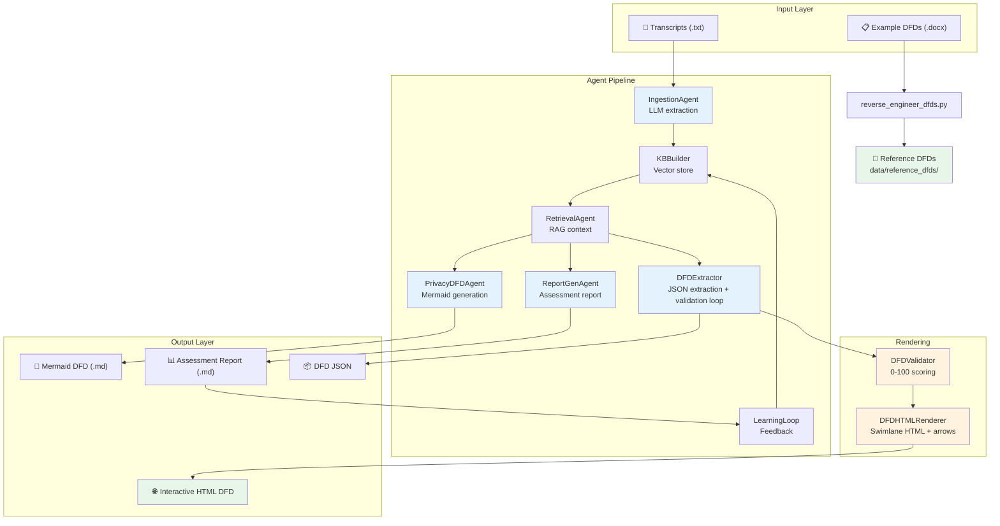
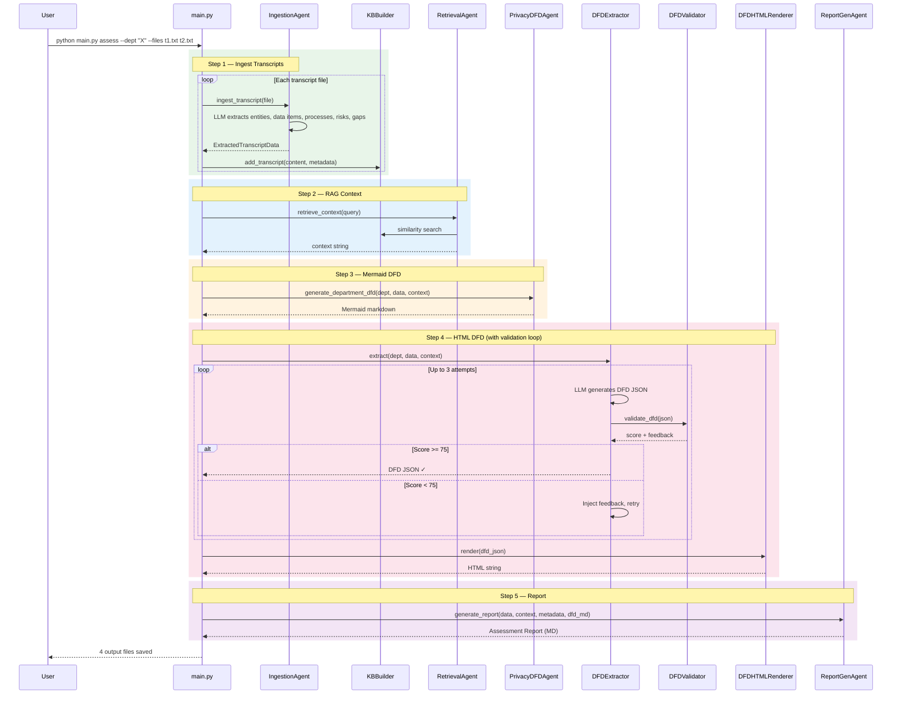
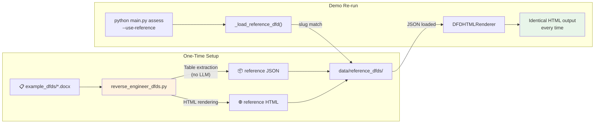
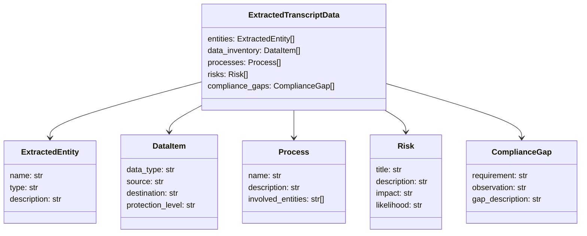

# PIA — Privacy Impact Assessment Agent

> AI-powered compliance documentation engine that transforms interview transcripts into professional Privacy Data Flow Diagrams (DFDs) and assessment reports.

---

## Architecture Overview



---

## Pipeline Flow — Single Department Assessment



---

## Project Structure

```
pia-python/
├── main.py                          # CLI orchestrator (assess / master)
├── config.py                        # API keys, paths, model settings
├── reverse_engineer_dfds.py         # Docx → reference DFD generator
├── preview_dfd.py                   # Standalone HTML DFD preview
│
├── agent/                           # AI agent modules
│   ├── ingestion.py                 # Transcript → structured data (LLM)
│   ├── kb_builder.py                # Vector store builder (embeddings)
│   ├── retrieval.py                 # RAG context retrieval
│   ├── privacy_dfd.py               # Mermaid DFD generation (LLM)
│   ├── dfd_extractor.py             # DFD JSON extraction (LLM + retry)
│   ├── dfd_validator.py             # DFD quality scoring (0-100)
│   ├── dfd_html_renderer.py         # Swimlane HTML + SVG arrows
│   ├── report_gen.py                # Assessment report generation (LLM)
│   └── learning.py                  # Feedback loop for KB
│
├── models/
│   └── extracted_data.py            # Pydantic data models
│
├── utils/
│   └── logger.py                    # Logging configuration
│
├── data/
│   ├── reports/                     # Generated assessment outputs
│   ├── reference_dfds/              # Pre-generated reference DFDs (16 depts)
│   └── vectors/                     # ChromaDB vector store
│
├── example_input/                   # Sample transcript files
│   ├── Session1_CC_Kickoff*.txt
│   ├── Session2_CC_IVR*.txt
│   ├── Session3_CC_Compliance*.txt
│   └── Session4_CC_Systems*.txt
│
└── example_dfds/                    # Original department docx reports
    ├── CustomerCare Department v1.1.docx
    ├── HR Department v1.2.docx
    ├── ... (17 department files)
    └── Master Assessment Report v1.1.docx
```

---

## How to Run

### Prerequisites

```bash
# 1. Python 3.11+
# 2. Install dependencies
pip install anthropic python-docx pydantic chromadb sentence-transformers

# 3. Set environment variables
echo "ANTHROPIC_API_KEY=sk-ant-..." > .env
```

### Command Reference

#### Single Department Assessment

```bash
# Full LLM-powered assessment (generates report + DFDs)
python main.py assess \
  --dept "Customer Care" \
  --files example_input/Session1*.txt example_input/Session2*.txt

# Output:
#   → data/reports/Customer_Care_Assessment_Report_YYYYMMDD.md
#   → data/reports/Customer_Care_Privacy_DFD_YYYYMMDD.md
#   → data/reports/Customer_Care_DFD_YYYYMMDD.html    ← Interactive DFD
#   → data/reports/Customer_Care_DFD_YYYYMMDD.json
```

#### Zero-Variance Mode (for demos)

```bash
# Uses pre-generated reference JSON — no LLM calls for DFD
python main.py assess \
  --dept "Customer Care" \
  --files example_input/Session1*.txt \
  --use-reference
```

#### Multi-Department + Master DFD

```bash
python main.py master \
  --depts "Customer Care" "HR" "IT" \
  --file-groups "cc1.txt,cc2.txt" "hr1.txt" "it1.txt"

# Output: individual reports + MASTER_DFD.html + MASTER_Privacy_DFD.md
```

#### Generate Reference DFDs from Example Docx

```bash
# Reverse-engineer all 17 department docx files → JSON + HTML
python reverse_engineer_dfds.py

# Output: data/reference_dfds/{dept_slug}.json + .html
```

#### Preview DFD (standalone test)

```bash
python preview_dfd.py
open data/reports/Customer_Care_DFD_preview.html
```

---

## How the Reference DFD System Works



**How slug matching works:**

| User Input | Slugified | Matches File |
|-----------|-----------|-------------|
| `"Customer Care"` | `customer_care` | `customer_care_department.json` |
| `"HR"` | `hr` | `human_resources_hr_ops_ta_training_development.json` |
| `"IT"` | `it` | `information_technology_department.json` |

The lookup tries exact match first, then substring match as fallback.

---

## DFD Validation Scoring

The `DFDValidator` scores every generated DFD on a 0-100 scale:

| Criteria | Points | Requirement |
|---------|--------|-------------|
| Actor types | 20 | Must have all 3: external, internal, vendor |
| Business processes | 10 | At least 2 per actor |
| Collection sources | 15 | Each process has data elements |
| Central process | 10 | Named processing unit exists |
| Dispersal sinks | 15 | At least 2 output destinations |
| Storage systems | 10 | At least 1 storage system |
| Data flows | 15 | Inbound + outbound flows present |
| **Pass threshold** | **75** | |

If the LLM produces a score < 75, DFDExtractor **automatically injects feedback** and retries (up to 3 attempts), keeping the highest-scoring result.

---

## HTML DFD Features

- **Swimlane layout** — CSS Grid with actor rows (Customers / Internal / Vendors)
- **4 lifecycle columns** — Data Collection → Processing → Dispersal → Storage
- **SVG fanned arrows** — Cubic Bezier curves with per-color arrowhead markers
- **Flow labels** — Mid-arrow text showing data type (e.g., "Customer Data")
- **Print/PDF support** — `@page A3 landscape`, `print-color-adjust: exact`, `beforeprint` arrow redraw
- **Edit mode** — Toggle to make all labels editable in-browser
- **Improved sink boxes** — Color-coded left bar, department/vendor icons, bold names

---

## Data Models



---

## Environment Variables

| Variable | Required | Description |
|---------|----------|-------------|
| `ANTHROPIC_API_KEY` | ✅ | Claude API key for LLM calls |
| `DATABASE_URL` | ❌ | Optional database URL |

---

## Tech Stack

| Component | Technology |
|-----------|-----------|
| LLM | Claude Sonnet 4 (Anthropic) |
| Embeddings | all-MiniLM-L6-v2 (sentence-transformers) |
| Vector Store | ChromaDB |
| Data Models | Pydantic v2 |
| Docx Parsing | python-docx |
| HTML DFD | Vanilla HTML/CSS/JS + SVG |
| Config | python-dotenv |
