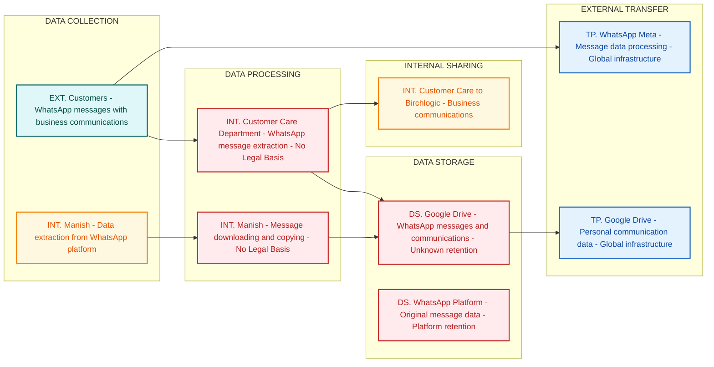

# Department Assessment Report

## Introduction

This report presents the findings of a comprehensive DPDPA and ISO 27001 compliance assessment conducted for the Birch Department on February 23, 2026. The assessment encompassed one detailed session to evaluate the department's data protection practices, security controls, and regulatory compliance posture regarding business communication activities and data storage practices.

The assessment identified critical compliance violations related to the use of consumer messaging platforms for business communications and unauthorized storage of communication data on third-party cloud services without proper authorization, consent mechanisms, or security controls. These activities present significant regulatory exposure under both the Digital Personal Data Protection Act (DPDPA) 2023 and ISO 27001 standards.

## Objectives

The primary objectives of this assessment were to:

1. **Document Communication Practices**: Map all business communication activities and data flows within the Birch Department
2. **Evaluate Data Protection Controls**: Assess the implementation of appropriate security measures for business communications
3. **Identify Compliance Gaps**: Analyze current practices against DPDPA consent requirements and ISO 27001 information security standards
4. **Risk Assessment**: Quantify data protection risks and their potential regulatory impact
5. **Provide Remediation Guidance**: Deliver actionable recommendations to achieve regulatory compliance and mitigate identified risks

## Department Overview

The Birch Department operates as a business unit within the broader organizational structure, with communication activities managed by key personnel including Manish, who oversees customer care operations and external communications.

**Key Personnel:**
- **Manish**: Department head responsible for customer service operations and business communications

**Primary Functions:**
- Business communication management via external messaging platforms
- Customer service coordination and support
- Data backup and archival activities

## Systems Landscape

The Birch Department operates through a limited technology ecosystem comprising external communication platforms and cloud storage services:

**Communication Platforms:**
- **WhatsApp**: Third-party messaging platform used for business communications with external parties including Birchlogic team

**Cloud Storage Infrastructure:**
- **Google Drive**: Third-party cloud storage service utilized for backing up WhatsApp messages and business communications

**Data Processing Activities:**
The department's core processes involve conducting business communications via WhatsApp and systematically backing up all messages to Google Drive for record-keeping purposes. These activities operate without documented data classification, security controls, or privacy impact assessments.

## Privacy Data Flow Analysis

## Privacy Data Flow Diagram

> The following Privacy DFD was generated from structured analysis of all interview transcripts.
> It maps personal data flows by lifecycle phase (Collection → Processing → Storage → Sharing → External Transfer)
> and identifies privacy risks at each stage.

## Section 1: Mermaid Privacy DFD

## Section 2: Privacy Data Mapping and Inventory Table

| S.No | Data Category | Description | Purpose | Legal Basis | Data Owner | Storage Location | Data Classification | Retention Period | Legal Obligation | Risk Level |
|------|--------------|-------------|---------|-------------|-----------|-----------------|--------------------|-----------------|--------------------|------------|
| 1 | Business Communications | WhatsApp messages containing business discussions and communications | Business communication with third-party service provider | No Legal Basis | Customer Care Department | Google Drive | PII | Unknown | DPDPA Section 8 - Consent required | HIGH |
| 2 | Personal Messages | Individual WhatsApp conversations and chat history | Data extraction and backup activities | No Legal Basis | Manish | Google Drive | Sensitive PII | Unknown | DPDPA Section 16 - DPIA required | HIGH |
| 3 | Contact Information | Phone numbers and contact details from WhatsApp communications | Communication and contact management | No Legal Basis | Customer Care Department | Google Drive | PII | Unknown | DPDPA Section 8 - Consent required | HIGH |
| 4 | Message Metadata | Timestamps, delivery status, and communication patterns | Data processing and analysis | No Legal Basis | Manish | Google Drive | PII | Unknown | DPDPA Section 8 - Consent required | MEDIUM |
| 5 | Communication Content | Text content of WhatsApp messages between parties | Business record keeping | No Legal Basis | Customer Care Department | WhatsApp Platform | PII | Platform retention | DPDPA Section 8 - Consent required | HIGH |

## Section 3: Privacy Risk Summary

**Risk 1: Unauthorized Data Extraction**
- Affected data subjects: WhatsApp message participants and communication counterparts
- Risk description: Personal communication data being systematically extracted from WhatsApp without proper authorization, consent mechanisms, or lawful basis for processing, violating fundamental privacy rights under DPDPA
- Applicable regulation: DPDPA Section 8 (Consent requirements) and Section 16 (Data Protection Impact Assessment)
- Recommended control: Immediately cease unauthorized data extraction activities and implement explicit consent mechanisms before any data processing

**Risk 2: Data Breach via Cloud Storage**
- Affected data subjects: All individuals whose messages are stored in Google Drive backups
- Risk description: Sensitive communication data stored on third-party cloud service without adequate protection measures, access controls, or encryption, creating exposure to unauthorized access and potential data breaches
- Applicable regulation: DPDPA Section 8 (Data security obligations) and ISO 27001 A.13.2.1 (Information transfer policies)
- Recommended control: Implement end-to-end encryption, access controls, and data classification for all cloud-stored personal communication data

**Risk 3: Cross-Border Data Transfer Violations**
- Affected data subjects: All communication data subjects whose data is processed through global infrastructure
- Risk description: Personal communication data transferred to Google Drive and WhatsApp's global infrastructure without adequate safeguards, consent, or compliance with data localization requirements
- Applicable regulation: DPDPA Section 16 (Cross-border data transfer restrictions)
- Recommended control: Implement data localization controls, transfer impact assessments, and adequate safeguards for international data transfers

**Risk 4: Lack of Data Subject Rights Framework**
- Affected data subjects: All individuals whose communications have been extracted and stored
- Risk description: No mechanisms in place for data subjects to exercise their rights including access, correction, deletion, and consent withdrawal as required under DPDPA
- Applicable regulation: DPDPA Sections 11-14 (Data Principal Rights)
- Recommended control: Establish comprehensive data subject rights fulfillment processes including identification, verification, and response mechanisms

## Key Observations

The assessment revealed several critical areas of concern regarding the department's communication and data storage practices:

1. **Uncontrolled Third-Party Platform Usage**: Business communications are conducted via consumer-grade messaging applications without enterprise security controls or data protection measures.

2. **Unauthorized Cloud Storage**: Communication data is systematically backed up to third-party cloud storage services without proper data protection impact assessments or security controls.

3. **Absence of Access Controls**: No documented access control mechanisms exist for communication data stored on cloud platforms, creating potential unauthorized access risks.

4. **Lack of Encryption Oversight**: The department has no control over encryption standards or security measures implemented by third-party service providers.

5. **Missing Data Classification**: Business communications are processed and stored without proper data classification or protection level assignments.

## Findings

### F1: Inadequate Business Communication Security Controls

**Observation**: The department conducts business communications with external parties, including the Birchlogic team, using WhatsApp, a consumer messaging platform that may not meet enterprise security requirements for business data protection.

**Impact**: Business communications conducted via consumer platforms expose sensitive information to potential security vulnerabilities and may not comply with ISO 27001 information security control requirements.

**Evidence**: Documented use of WhatsApp for business communications without assessment of platform security controls or data protection measures.

### F2: Unauthorized Third-Party Data Storage

**Observation**: All WhatsApp messages containing business communications are systematically backed up to Google Drive without conducting proper data protection impact assessments or implementing adequate security controls.

**Impact**: Storage of business communications on third-party cloud services without proper authorization and protection measures violates DPDPA data protection by design principles and creates potential data breach exposure.

**Evidence**: Confirmed automatic backup process of WhatsApp messages to Google Drive without documented security controls or data protection measures.

### F3: Absence of Access Control Framework

**Observation**: No documented access control mechanisms exist for communication data stored on Google Drive, creating uncertainty regarding who can access backed-up business communications.

**Impact**: Lack of access controls violates ISO 27001 access control requirements and creates risk of unauthorized access to sensitive business communications.

**Evidence**: No mention of access control policies or procedures for cloud-stored communication data during assessment session.

## Risks

| Risk ID | Title | Description | Impact | Likelihood | Rating |
|---------|-------|-------------|--------|------------|--------|
| R1 | Unauthorized Data Access | Business communications stored on third-party platforms may be accessed by unauthorized parties due to inadequate access controls | Medium | Medium | Medium |
| R2 | Data Breach via Cloud Storage | WhatsApp messages containing business information backed up to Google Drive may be compromised through cloud service vulnerabilities | Medium | Low | Medium |
| R3 | Lack of Encryption Control | No oversight of encryption standards used by third-party messaging and storage platforms creates potential data exposure risks | Medium | High | High |
| R4 | Regulatory Non-Compliance | Use of consumer platforms for business communications without proper controls may violate DPDPA and ISO 27001 requirements | High | High | High |
| R5 | Data Residency Violations | Storage of business communications on global cloud infrastructure may violate data localization requirements | Medium | Medium | Medium |

## Recommendations

### Immediate Actions (0-30 days)

**R1.1: Communication Platform Assessment**
- Conduct immediate security assessment of WhatsApp usage for business communications
- Document all business data currently processed through consumer messaging platforms
- Implement temporary restrictions on sensitive data sharing via WhatsApp

**R1.2: Cloud Storage Audit**
- Inventory all business communications currently stored on Google Drive
- Implement immediate access controls and encryption for existing cloud-stored data
- Suspend automatic backup processes until proper security controls are established

**R1.3: Risk Mitigation Measures**
- Establish interim data handling procedures for business communications
- Implement data classification framework for communication content
- Create incident response procedures for potential data exposure events

### Short-term Actions (30-90 days)

**R2.1: Enterprise Communication Solution**
- Evaluate and procure enterprise-grade communication platforms with appropriate security controls
- Implement business communication policies compliant with ISO 27001 requirements
- Establish data retention and deletion policies for business communications

**R2.2: Security Control Implementation**
- Deploy encryption and access controls for all business communication data
- Implement data loss prevention (DLP) measures for communication platforms
- Establish monitoring and logging capabilities for communication activities

**R2.3: Compliance Framework Development**
- Conduct Data Protection Impact Assessment for all communication processing activities
- Develop standard operating procedures for secure business communications
- Implement privacy by design principles in communication workflows

### Long-term Actions (90+ days)

**R3.1: Comprehensive Security Architecture**
- Design and implement enterprise communication architecture with embedded security controls
- Deploy advanced threat protection and monitoring solutions
- Establish continuous compliance monitoring and reporting mechanisms

**R3.2: Governance and Training**
- Develop comprehensive communication security training programs
- Implement regular security assessments and compliance audits
- Establish communication security governance committee with oversight responsibilities

**R3.3: Technology Integration**
- Integrate communication platforms with existing security infrastructure
- Implement automated compliance monitoring and violation detection
- Deploy advanced analytics for communication security monitoring

## Conclusion

The Birch Department assessment reveals significant compliance gaps requiring immediate remediation to align with DPDPA and ISO 27001 requirements. The current practice of using consumer messaging platforms for business communications and storing communication data on third-party cloud services without proper security controls creates substantial regulatory and security risks.

The identified violations expose the organization to potential regulatory penalties and security breaches due to inadequate data protection measures and lack of enterprise-grade security controls. The systematic nature of these practices, combined with the absence of proper governance frameworks, creates an urgent need for comprehensive remediation.

Priority must be given to implementing enterprise communication solutions, establishing proper access controls, and conducting thorough data protection impact assessments. The department cannot continue current communication practices without establishing appropriate security measures and compliance frameworks.

Successful implementation of the recommended controls will establish a robust communication security framework aligned with regulatory requirements while maintaining operational efficiency. The estimated timeline for full compliance implementation is 6-9 months, with critical security controls requiring deployment within 30 days to mitigate immediate risks.

Executive sponsorship and dedicated project resources will be essential for successful remediation execution, ensuring that all business communication activities comply with applicable data protection and information security standards.