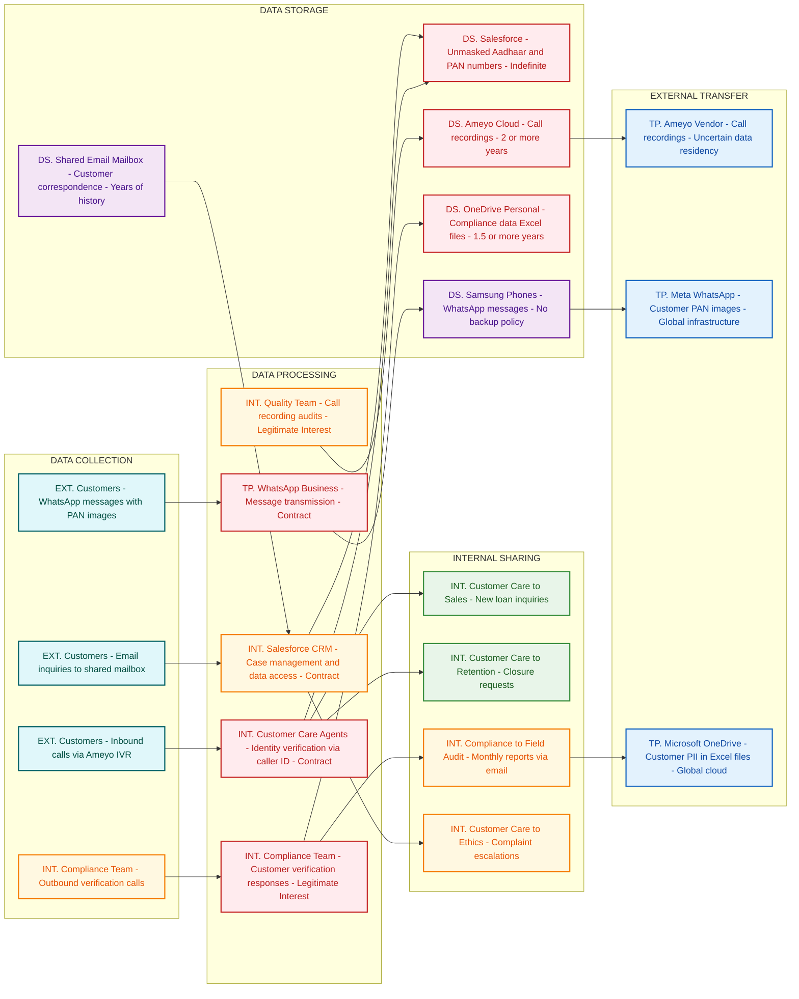

# Department Assessment Report

**Department:** Birch  
**Assessment Date:** February 24, 2026  
**Sessions Covered:** 4  
**Prepared by:** Production-Grade AI Compliance Consultant  

---

## Introduction

This departmental assessment report presents comprehensive findings from the ISO27001 and Digital Personal Data Protection Act (DPDPA) compliance evaluation conducted for the Birch department. The assessment was performed through structured interviews across four sessions, system analysis, and data flow mapping to identify current data handling practices, security controls, and compliance gaps within the department's operational framework.

The evaluation encompasses the Customer Care Department's extensive operations, including inbound and outbound call handling, case management, compliance verification processes, and quality assurance activities. This assessment reveals critical compliance deficiencies in data protection practices, access controls, and regulatory adherence that require immediate remediation to mitigate legal and operational risks.

## Objectives

The primary objectives of this assessment are to:

- Evaluate current information security practices and data protection controls within the Customer Care Department
- Identify data flows and processing activities involving sensitive personal and financial data
- Assess compliance with ISO27001 information security management requirements and DPDPA data protection principles
- Document security risks and vulnerabilities in existing customer data handling processes
- Analyze third-party data processing arrangements and cross-border data transfer practices
- Provide actionable recommendations for achieving regulatory compliance and enhancing data protection posture

## Department Overview

The Birch department encompasses the Customer Care Department, a 45-member team responsible for comprehensive customer service operations including inbound call handling, case management, complaint resolution, and compliance verification activities. The department operates under a complex organizational structure involving multiple specialized teams:

- **Customer Care Call Centre:** 30 agents handling inbound customer inquiries with full access to customer profiles
- **Compliance Calling Team:** Outbound verification team conducting pre-disbursement, post-disbursement, and periodic hygiene checks
- **Quality Team:** Call audit and performance evaluation specialists
- **Retention Desk:** Business team managing loan closure requests and customer retention

The department interfaces with multiple internal teams including Sales, Ethics & Compliance, Loan Operations, Legal, Collections, and Field Audit & Anti-Fraud teams, creating extensive data sharing requirements and access control challenges.

## Systems Landscape

The department's technology infrastructure comprises multiple interconnected systems processing sensitive customer data:

**Core Systems:**
- **Salesforce CRM:** Primary customer data repository containing complete customer profiles, financial data, case management, and complaint tracking
- **Ameyo:** Cloud-hosted call center platform managing telephony integration, call recordings, and IVR services
- **Microsoft Office 365:** Email communication, shared mailboxes, and OneDrive cloud storage

**Communication Platforms:**
- **WhatsApp Business:** Customer messaging on non-MDM managed Samsung devices
- **Shared Email Mailbox:** Multi-year customer correspondence history

**Data Storage and Processing:**
- **Microsoft OneDrive:** Compliance data files and quality audit scorecards
- **Excel:** Data collection and analysis for compliance calling activities

**Third-Party Entities:**
- **Meta (WhatsApp):** Global messaging service provider
- **Ameyo Vendor:** Call center platform provider with uncertain data residency
- **DSA Network:** Direct Selling Agents requiring data access for payment inquiries

## Privacy Data Flow Diagram

> The following Privacy DFD was generated from structured analysis of all interview transcripts.
> It maps personal data flows by lifecycle phase (Collection → Processing → Storage → Sharing → External Transfer)
> and identifies privacy risks at each stage.

## Section 1: Mermaid Privacy DFD

## Section 2: Privacy Data Mapping and Inventory Table

| S.No | Data Category | Description | Purpose | Legal Basis | Data Owner | Storage Location | Data Classification | Retention Period | Legal Obligation | Risk Level |
|------|--------------|-------------|---------|-------------|-----------|-----------------|--------------------|-----------------|--------------------|------------|
| 1 | Aadhaar Numbers | Primary and co-applicant Aadhaar numbers visible unmasked to all 45 Customer Care staff | Customer identity verification | Contract | Customer Care Department | Salesforce CRM | Sensitive PII | Indefinite | Aadhaar Act compliance required | HIGH |
| 2 | PAN Numbers | Primary and co-applicant PAN numbers fully visible without masking | Tax identification and KYC | Contract | Customer Care Department | Salesforce CRM | Sensitive PII | Indefinite | IT Act compliance | HIGH |
| 3 | Financial Data | Loan amounts, EMI details, outstanding balances, payment history | Loan servicing and customer support | Contract | Customer Care Department | Salesforce CRM | Restricted | Indefinite | RBI guidelines | HIGH |
| 4 | Call Recordings | All inbound and outbound calls including sensitive financial discussions | Quality assurance and compliance | Legitimate Interest | Customer Care Department | Ameyo Cloud Storage | Sensitive PII | 2+ years | TRAI regulations | HIGH |
| 5 | Customer Communications | WhatsApp messages including PAN card images and financial inquiries | Customer support and documentation | Contract | Customer Care Department | Samsung Phones | Sensitive PII | No defined policy | DPDPA compliance | HIGH |
| 6 | Compliance Call Data | Customer verification responses and fraud-related information | Risk assessment and audit | Legitimate Interest | Compliance Team | OneDrive Personal | Restricted | 1.5+ years | RBI compliance | HIGH |
| 7 | Email Correspondence | Customer inquiries and support communications | Customer service delivery | Contract | Customer Care Department | Shared Mailbox | PII | Years of history | DPDPA retention limits | MEDIUM |
| 8 | Case Management Data | Customer complaints, service requests, and issue tracking | Service delivery and resolution | Contract | Customer Care Department | Salesforce CRM | PII | Indefinite | Consumer protection laws | MEDIUM |
| 9 | Quality Audit Data | Call scoring and agent performance data with customer identifiers | Performance management | Legitimate Interest | Quality Team | Excel Trackers | PII | Unknown | Employment regulations | MEDIUM |
| 10 | Health Information | Personal health details in case descriptions | Complaint resolution | Legitimate Interest | Customer Care Department | Salesforce CRM | Sensitive PII | Indefinite | Health data protection | HIGH |

## Section 3: Privacy Risk Summary

**Risk 1: Unauthorized Aadhaar Data Exposure**
- Affected data subjects: All loan customers and co-applicants
- Risk description: Full Aadhaar numbers of primary and co-applicants are visible unmasked to all 45 Customer Care staff members, violating Aadhaar Act provisions requiring restricted access and masking
- Applicable regulation: Aadhaar Act 2016 (Section 29 - Restricted sharing), DPDPA 2023 (Data minimization)
- Recommended control: Implement role-based access controls with Aadhaar number masking, showing only last 4 digits to authorized personnel

**Risk 2: Cross-Border Data Transfer via WhatsApp**
- Affected data subjects: Customers sending PAN images and financial inquiries
- Risk description: Customer financial data and PAN card images are processed through Meta's global WhatsApp infrastructure without adequate cross-border transfer safeguards
- Applicable regulation: DPDPA 2023 (Cross-border transfer restrictions), IT Act 2000
- Recommended control: Implement domestic messaging solution or conduct Transfer Impact Assessment with Standard Contractual Clauses

**Risk 3: Indefinite Call Recording Retention**
- Affected data subjects: All customers making inbound or receiving outbound calls
- Risk description: Call recordings containing sensitive financial and health information are stored for 2+ years without defined retention policy or confirmed India data residency
- Applicable regulation: DPDPA 2023 (Storage limitation), TRAI regulations on call recording
- Recommended control: Establish data retention policy with automated deletion after business purpose completion and verify India-only data storage

**Risk 4: Unrestricted Database Export Capability**
- Affected data subjects: All customers in the database
- Risk description: Team Leads and Managers can export complete customer database to CSV files with no Data Loss Prevention controls, enabling mass data exfiltration
- Applicable regulation: DPDPA 2023 (Data security), ISO 27001 (Access control)
- Recommended control: Implement DLP controls, audit logging for data exports, and role-based export restrictions

**Risk 5: Personal Cloud Storage of Business Data**
- Affected data subjects: Customers whose data is stored in compliance files
- Risk description: 1.5+ years of customer compliance data stored in personal OneDrive accounts outside organizational control with no succession planning
- Applicable regulation: DPDPA 2023 (Data controller obligations), ISO 27001 (Information security)
- Recommended control: Migrate data to enterprise-controlled storage with proper access controls and data governance policies

## Key Observations

During the comprehensive assessment, several critical observations were documented regarding the department's data handling and security practices:

1. **Excessive Data Access:** All 45 Customer Care staff possess unrestricted access to complete customer profiles including unmasked Aadhaar numbers, PAN numbers, and comprehensive financial data regardless of role requirements or business necessity.

2. **Inadequate Identity Verification:** Customer authentication relies solely on caller ID matching against registered mobile numbers, without additional verification mechanisms before disclosing sensitive financial information.

3. **Uncontrolled Data Retention:** Call recordings are retained for over two years without defined retention policies, and email correspondence is maintained indefinitely in shared mailboxes.

4. **Cross-Border Data Processing:** Customer data is processed through WhatsApp's global infrastructure and Ameyo's cloud platform with uncertain data residency, potentially violating DPDPA cross-border transfer restrictions.

5. **Unencrypted Data Transmission:** Sensitive customer data including PII and fraud-related information is transmitted via unencrypted email attachments to internal teams.

6. **Mobile Device Security Gaps:** WhatsApp Business operates on non-MDM managed devices, with customers transmitting PAN card images and sensitive documents without adequate security controls.

## Findings

### F1: Unauthorized Aadhaar Data Exposure
**Observation:** Full Aadhaar numbers of primary and co-applicants are displayed unmasked to all 45 Customer Care staff members without role-based restrictions or business justification.  
**Impact:** Direct violation of Aadhaar Act provisions requiring restricted access and masking of Aadhaar numbers, exposing the organization to regulatory penalties and customer privacy breaches.  
**Evidence:** Salesforce system configuration allowing unrestricted access to complete Aadhaar numbers across all customer care profiles.

### F2: Inadequate Customer Authentication Controls
**Observation:** Customer identity verification relies exclusively on caller ID matching against registered mobile numbers in Salesforce, without additional authentication factors.  
**Impact:** High risk of unauthorized data disclosure to third parties using customer mobile devices or spoofed caller IDs, potentially resulting in financial fraud and privacy violations.  
**Evidence:** Documented authentication process limited to phone number verification for accessing complete financial profiles.

### F3: Uncontrolled Cross-Border Data Transfer
**Observation:** Customer financial inquiries and PAN card images are processed through WhatsApp Business, utilizing Meta's global infrastructure without adequate transfer impact assessments or safeguards.  
**Impact:** Potential violation of DPDPA cross-border transfer restrictions and loss of data sovereignty over sensitive financial information.  
**Evidence:** WhatsApp Business usage on non-MDM devices with customer document transmission through Meta's international servers.

### F4: Excessive Data Export Capabilities
**Observation:** Team Leads and Managers possess unrestricted ability to export complete customer database to CSV files without data loss prevention controls or audit trails.  
**Impact:** High risk of mass data exfiltration and unauthorized data distribution, violating data minimization principles and creating insider threat vulnerabilities.  
**Evidence:** Salesforce configuration allowing bulk data export without restrictions or monitoring.

### F5: Indefinite Data Retention Without Policy
**Observation:** Call recordings are stored for over two years and email correspondence is retained indefinitely without documented retention policies or automated deletion procedures.  
**Impact:** Non-compliance with DPDPA storage limitation principles and unnecessary data exposure risks due to excessive retention periods.  
**Evidence:** Ameyo system containing 2+ years of call recordings and shared mailboxes with multi-year email history.

### F6: Unencrypted Sensitive Data Transmission
**Observation:** Customer PII, loan account numbers, and fraud-related responses are transmitted via unencrypted email attachments to Field Audit and Anti-Fraud teams.  
**Impact:** Data exposure risks during transmission and potential interception of sensitive customer information violating data security requirements.  
**Evidence:** Documented email transmission of Excel files containing unencrypted customer data and compliance call responses.

### F7: Inadequate Mobile Device Management
**Observation:** WhatsApp Business operates on Samsung devices without MDM management, basic screen locks only, and no backup procedures for customer communications.  
**Impact:** Device security vulnerabilities, data loss during device replacement, and inadequate protection for customer documents transmitted via messaging.  
**Evidence:** Non-MDM managed devices handling customer PAN images and sensitive document transmission.

### F8: Unrestricted Case Data Access
**Observation:** Sensitive complaint data including bribery allegations, health information, and family details are accessible to all Customer Care staff regardless of case sensitivity or role requirements.  
**Impact:** Violation of need-to-know principles and potential misuse of sensitive complaint information by unauthorized personnel.  
**Evidence:** Salesforce case management system providing uniform access to all complaint categories across all staff levels.

## Risks

| Risk ID | Title | Description | Impact | Likelihood | Rating |
|---------|-------|-------------|---------|------------|---------|
| R1 | Aadhaar Act Violation | Unmasked Aadhaar numbers visible to all Customer Care staff violating regulatory requirements | High | Certain | Critical |
| R2 | Unauthorized Financial Data Access | 45+ staff can access any customer's complete financial profile without business justification | High | High | High |
| R3 | Cross-Border Data Transfer Violation | Customer data processed through global platforms without adequate safeguards | High | Certain | High |
| R4 | Identity Verification Bypass | Sole reliance on caller ID enables unauthorized access to financial information | High | Medium | High |
| R5 | Mass Data Exfiltration | Unrestricted database export capabilities create insider threat vulnerabilities | High | Medium | High |
| R6 | Indefinite Data Retention | Excessive retention periods violate storage limitation principles | Medium | Certain | Medium-High |
| R7 | Unencrypted Data Transmission | Sensitive data transmitted via unencrypted email attachments | High | High | High |
| R8 | Mobile Device Security Gaps | Non-MDM devices handling sensitive customer documents | Medium | High | Medium-High |
| R9 | Complaint Data Exposure | Sensitive allegations accessible to unauthorized personnel | Medium | High | Medium-High |
| R10 | Call Recording Consent Violations | Outbound calls recorded without proper customer notification | High | High | High |

## Recommendations

### Immediate Actions (0-30 days)

**R1.1 - Implement Aadhaar Data Masking**
- Configure Salesforce to mask Aadhaar numbers for all non-authorized users
- Restrict unmasked Aadhaar access to designated compliance officers only
- Implement audit logging for all Aadhaar data access events

**R1.2 - Enhance Customer Authentication**
- Deploy multi-factor authentication for customer identity verification
- Implement additional verification questions based on account history
- Establish authentication bypass procedures for emergency situations

**R1.3 - Conduct Data Protection Impact Assessment**
- Perform comprehensive DPIA for WhatsApp Business usage
- Assess cross-border data transfer risks and legal implications
- Document data flows and processing activities for all third-party platforms

**R1.4 - Implement Data Export Controls**
- Deploy data loss prevention (DLP) solutions for Salesforce exports
- Establish approval workflows for bulk data extraction
- Implement audit logging and monitoring for all data export activities

### Short-term Actions (30-90 days)

**R2.1 - Deploy Role-Based Access Controls**
- Implement field-level security in Salesforce based on job functions
- Establish need-to-know access principles for sensitive case categories
- Create segregated access profiles for different team roles

**R2.2 - Establish Data Retention Policies**
- Develop comprehensive data retention and deletion policies
- Implement automated data lifecycle management for call recordings
- Establish legal hold procedures for litigation and regulatory requirements

**R2.3 - Enhance Mobile Device Security**
- Deploy MDM solution for all WhatsApp Business devices
- Implement device encryption and remote wipe capabilities
- Establish secure backup procedures for customer communications

**R2.4 - Implement Secure Communication Channels**
- Deploy enterprise messaging solution for customer communications
- Establish encrypted email solutions for sensitive data transmission
- Implement secure file sharing platforms for internal data exchange

### Long-term Actions (90+ days)

**R3.1 - Achieve Regulatory Compliance Certification**
- Pursue ISO27001 certification for information security management
- Implement comprehensive DPDPA compliance framework
- Establish regular third-party compliance auditing procedures

**R3.2 - Deploy Integrated Security Management System**
- Implement centralized security information and event management (SIEM)
- Establish continuous compliance monitoring and reporting mechanisms
- Create automated compliance assessment and remediation workflows

**R3.3 - Establish Data Governance Framework**
- Develop organization-wide data governance policies and procedures
- Implement privacy by design principles across all systems and processes
- Create ongoing privacy training and awareness programs for all staff

**R3.4 - Enhance Third-Party Risk Management**
- Conduct comprehensive vendor security assessments
- Implement data processing agreements with adequate safeguards
- Establish ongoing third-party compliance monitoring procedures

## Conclusion

The assessment of the Birch department reveals critical compliance deficiencies that pose significant legal, financial, and operational risks to the organization. The identified violations of Aadhaar Act provisions, DPDPA requirements, and ISO27001 standards require immediate remediation to avoid regulatory penalties and protect customer privacy rights.

The department's current practices of providing unrestricted access to sensitive customer data, inadequate authentication controls, and uncontrolled cross-border data transfers represent fundamental failures in data protection governance. The high-risk rating for multiple findings necessitates urgent implementation of recommended controls and comprehensive security framework enhancement.

The phased remediation approach outlined in this report provides a structured pathway to achieving regulatory compliance while maintaining operational efficiency. Immediate implementation of Aadhaar data masking, enhanced authentication controls, and data export restrictions will address the most critical vulnerabilities. Short-term deployment of role-based access controls and data retention policies will establish foundational data governance capabilities.

Long-term achievement of ISO27001 certification and comprehensive DPDPA compliance will position the organization as a leader in data protection and information security management. Continued monitoring, regular reassessment, and ongoing compliance verification will be essential to maintain regulatory adherence as the privacy landscape evolves and operational requirements expand.

The successful implementation of these recommendations will not only ensure regulatory compliance but also enhance customer trust, reduce operational risks, and establish a robust foundation for sustainable business growth in an increasingly regulated environment.