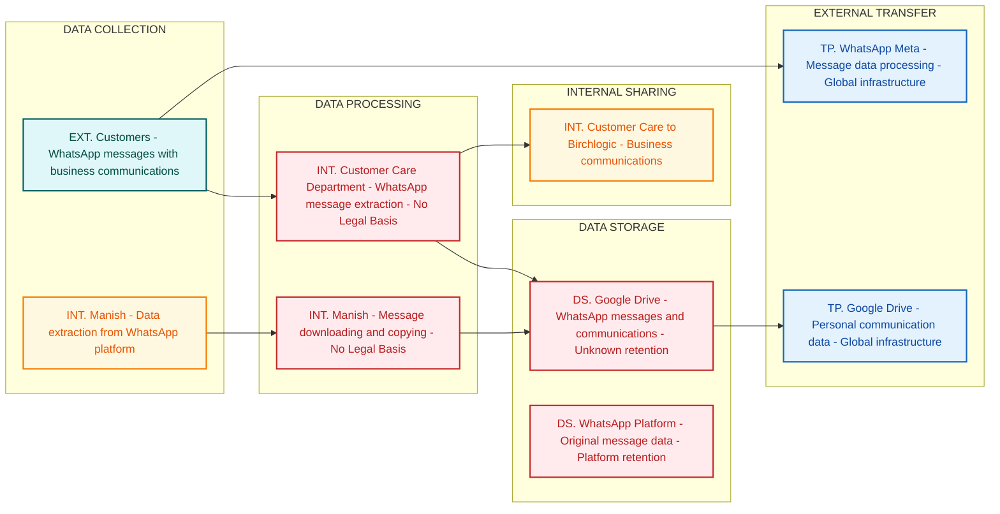

# Privacy Data Flow Diagram
## Birch Department

## Section 1: Mermaid Privacy DFD

## Section 2: Privacy Data Mapping and Inventory Table

| S.No | Data Category | Description | Purpose | Legal Basis | Data Owner | Storage Location | Data Classification | Retention Period | Legal Obligation | Risk Level |
|------|--------------|-------------|---------|-------------|-----------|-----------------|--------------------|-----------------|--------------------|------------|
| 1 | Business Communications | WhatsApp messages containing business discussions and communications | Business communication with third-party service provider | No Legal Basis | Customer Care Department | Google Drive | PII | Unknown | DPDPA Section 8 - Consent required | HIGH |
| 2 | Personal Messages | Individual WhatsApp conversations and chat history | Data extraction and backup activities | No Legal Basis | Manish | Google Drive | Sensitive PII | Unknown | DPDPA Section 16 - DPIA required | HIGH |
| 3 | Contact Information | Phone numbers and contact details from WhatsApp communications | Communication and contact management | No Legal Basis | Customer Care Department | Google Drive | PII | Unknown | DPDPA Section 8 - Consent required | HIGH |
| 4 | Message Metadata | Timestamps, delivery status, and communication patterns | Data processing and analysis | No Legal Basis | Manish | Google Drive | PII | Unknown | DPDPA Section 8 - Consent required | MEDIUM |
| 5 | Communication Content | Text content of WhatsApp messages between parties | Business record keeping | No Legal Basis | Customer Care Department | WhatsApp Platform | PII | Platform retention | DPDPA Section 8 - Consent required | HIGH |

## Section 3: Privacy Risk Summary

**Risk 1: Unauthorized Data Extraction**
- Affected data subjects: WhatsApp message participants and communication counterparts
- Risk description: Personal communication data being systematically extracted from WhatsApp without proper authorization, consent mechanisms, or lawful basis for processing, violating fundamental privacy rights under DPDPA
- Applicable regulation: DPDPA Section 8 (Consent requirements) and Section 16 (Data Protection Impact Assessment)
- Recommended control: Immediately cease unauthorized data extraction activities and implement explicit consent mechanisms before any data processing

**Risk 2: Data Breach via Cloud Storage**
- Affected data subjects: All individuals whose messages are stored in Google Drive backups
- Risk description: Sensitive communication data stored on third-party cloud service without adequate protection measures, access controls, or encryption, creating exposure to unauthorized access and potential data breaches
- Applicable regulation: DPDPA Section 8 (Data security obligations) and ISO 27001 A.13.2.1 (Information transfer policies)
- Recommended control: Implement end-to-end encryption, access controls, and data classification for all cloud-stored personal communication data

**Risk 3: Cross-Border Data Transfer Violations**
- Affected data subjects: All communication data subjects whose data is processed through global infrastructure
- Risk description: Personal communication data transferred to Google Drive and WhatsApp's global infrastructure without adequate safeguards, consent, or compliance with data localization requirements
- Applicable regulation: DPDPA Section 16 (Cross-border data transfer restrictions)
- Recommended control: Implement data localization controls, transfer impact assessments, and adequate safeguards for international data transfers

**Risk 4: Lack of Data Subject Rights Framework**
- Affected data subjects: All individuals whose communications have been extracted and stored
- Risk description: No mechanisms in place for data subjects to exercise their rights including access, correction, deletion, and consent withdrawal as required under DPDPA
- Applicable regulation: DPDPA Sections 11-14 (Data Principal Rights)
- Recommended control: Establish comprehensive data subject rights fulfillment processes including identification, verification, and response mechanisms