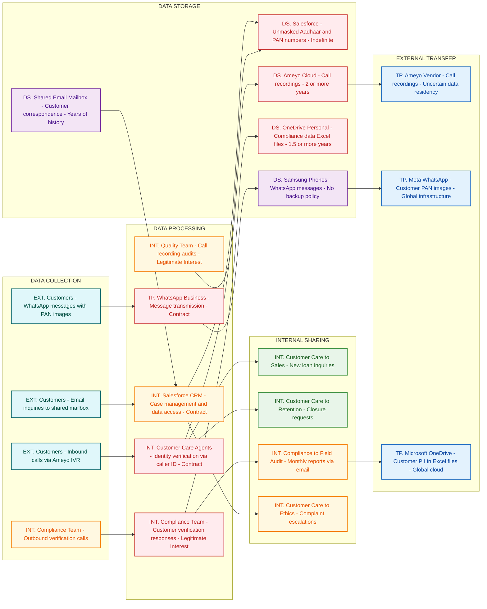

# Privacy Data Flow Diagram
## Birch Department

## Section 1: Mermaid Privacy DFD

## Section 2: Privacy Data Mapping and Inventory Table

| S.No | Data Category | Description | Purpose | Legal Basis | Data Owner | Storage Location | Data Classification | Retention Period | Legal Obligation | Risk Level |
|------|--------------|-------------|---------|-------------|-----------|-----------------|--------------------|-----------------|--------------------|------------|
| 1 | Aadhaar Numbers | Primary and co-applicant Aadhaar numbers visible unmasked to all 45 Customer Care staff | Customer identity verification | Contract | Customer Care Department | Salesforce CRM | Sensitive PII | Indefinite | Aadhaar Act compliance required | HIGH |
| 2 | PAN Numbers | Primary and co-applicant PAN numbers fully visible without masking | Tax identification and KYC | Contract | Customer Care Department | Salesforce CRM | Sensitive PII | Indefinite | IT Act compliance | HIGH |
| 3 | Financial Data | Loan amounts, EMI details, outstanding balances, payment history | Loan servicing and customer support | Contract | Customer Care Department | Salesforce CRM | Restricted | Indefinite | RBI guidelines | HIGH |
| 4 | Call Recordings | All inbound and outbound calls including sensitive financial discussions | Quality assurance and compliance | Legitimate Interest | Customer Care Department | Ameyo Cloud Storage | Sensitive PII | 2+ years | TRAI regulations | HIGH |
| 5 | Customer Communications | WhatsApp messages including PAN card images and financial inquiries | Customer support and documentation | Contract | Customer Care Department | Samsung Phones | Sensitive PII | No defined policy | DPDPA compliance | HIGH |
| 6 | Compliance Call Data | Customer verification responses and fraud-related information | Risk assessment and audit | Legitimate Interest | Compliance Team | OneDrive Personal | Restricted | 1.5+ years | RBI compliance | HIGH |
| 7 | Email Correspondence | Customer inquiries and support communications | Customer service delivery | Contract | Customer Care Department | Shared Mailbox | PII | Years of history | DPDPA retention limits | MEDIUM |
| 8 | Case Management Data | Customer complaints, service requests, and issue tracking | Service delivery and resolution | Contract | Customer Care Department | Salesforce CRM | PII | Indefinite | Consumer protection laws | MEDIUM |
| 9 | Quality Audit Data | Call scoring and agent performance data with customer identifiers | Performance management | Legitimate Interest | Quality Team | Excel Trackers | PII | Unknown | Employment regulations | MEDIUM |
| 10 | Health Information | Personal health details in case descriptions | Complaint resolution | Legitimate Interest | Customer Care Department | Salesforce CRM | Sensitive PII | Indefinite | Health data protection | HIGH |

## Section 3: Privacy Risk Summary

**Risk 1: Unauthorized Aadhaar Data Exposure**
- Affected data subjects: All loan customers and co-applicants
- Risk description: Full Aadhaar numbers of primary and co-applicants are visible unmasked to all 45 Customer Care staff members, violating Aadhaar Act provisions requiring restricted access and masking
- Applicable regulation: Aadhaar Act 2016 (Section 29 - Restricted sharing), DPDPA 2023 (Data minimization)
- Recommended control: Implement role-based access controls with Aadhaar number masking, showing only last 4 digits to authorized personnel

**Risk 2: Cross-Border Data Transfer via WhatsApp**
- Affected data subjects: Customers sending PAN images and financial inquiries
- Risk description: Customer financial data and PAN card images are processed through Meta's global WhatsApp infrastructure without adequate cross-border transfer safeguards
- Applicable regulation: DPDPA 2023 (Cross-border transfer restrictions), IT Act 2000
- Recommended control: Implement domestic messaging solution or conduct Transfer Impact Assessment with Standard Contractual Clauses

**Risk 3: Indefinite Call Recording Retention**
- Affected data subjects: All customers making inbound or receiving outbound calls
- Risk description: Call recordings containing sensitive financial and health information are stored for 2+ years without defined retention policy or confirmed India data residency
- Applicable regulation: DPDPA 2023 (Storage limitation), TRAI regulations on call recording
- Recommended control: Establish data retention policy with automated deletion after business purpose completion and verify India-only data storage

**Risk 4: Unrestricted Database Export Capability**
- Affected data subjects: All customers in the database
- Risk description: Team Leads and Managers can export complete customer database to CSV files with no Data Loss Prevention controls, enabling mass data exfiltration
- Applicable regulation: DPDPA 2023 (Data security), ISO 27001 (Access control)
- Recommended control: Implement DLP controls, audit logging for data exports, and role-based export restrictions

**Risk 5: Personal Cloud Storage of Business Data**
- Affected data subjects: Customers whose data is stored in compliance files
- Risk description: 1.5+ years of customer compliance data stored in personal OneDrive accounts outside organizational control with no succession planning
- Applicable regulation: DPDPA 2023 (Data controller obligations), ISO 27001 (Information security)
- Recommended control: Migrate data to enterprise-controlled storage with proper access controls and data governance policies