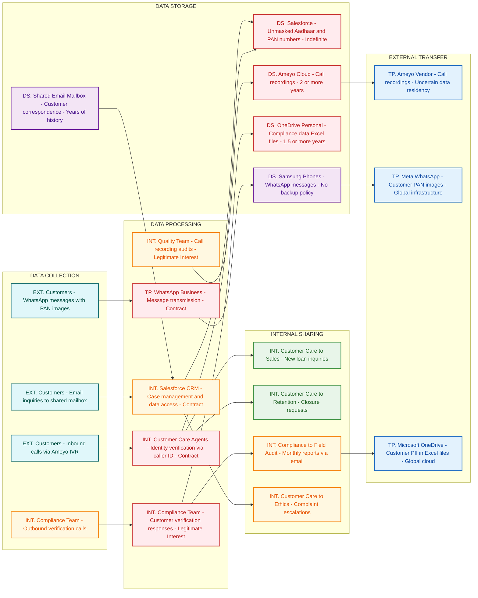

# Department Assessment Report

**Department:** Customer Care  
**Assessment Date:** February 24, 2026  
**Sessions Covered:** 4  
**Prepared by:** Production-Grade AI Compliance Consultant

---

## Introduction

This departmental assessment report presents comprehensive findings from the ISO27001 and Digital Personal Data Protection Act (DPDPA) compliance evaluation conducted for the Customer Care department. The assessment was performed through structured interviews across four sessions, system analysis, and data flow mapping to identify current data handling practices, security controls, and compliance gaps within the department's operational framework.

The evaluation encompasses the Customer Care Department's extensive operations, including inbound and outbound call handling, case management, compliance verification processes, and quality assurance activities. This assessment reveals critical compliance deficiencies in data protection practices, access controls, and regulatory adherence that require immediate remediation to mitigate legal and operational risks.

The findings indicate severe violations of the Aadhaar Act, DPDPA data protection principles, and ISO27001 information security controls, with particular concerns regarding unauthorized access to sensitive personal data, inadequate authentication mechanisms, and uncontrolled cross-border data transfers.

## Objectives

The primary objectives of this assessment are to:

- Evaluate current information security practices and data protection controls within the Customer Care Department
- Identify data flows and processing activities involving sensitive personal and financial data
- Assess compliance with ISO27001 information security management requirements and DPDPA data protection principles
- Document security risks and vulnerabilities in existing customer data handling processes
- Analyze third-party data processing arrangements and cross-border data transfer practices
- Provide actionable recommendations for achieving regulatory compliance and enhancing data protection posture

## Department Overview

The Customer Care department comprises a 45-member team responsible for comprehensive customer service operations including inbound call handling, case management, complaint resolution, and compliance verification activities. The department operates under a complex organizational structure involving multiple specialized teams:

**Core Teams:**
- **Customer Care Call Centre:** 30 agents handling inbound customer inquiries with unrestricted access to complete customer profiles
- **Compliance Calling Team:** 8-member outbound verification team conducting pre-disbursement, post-disbursement, and periodic hygiene checks
- **Quality Team:** Call audit and performance evaluation specialists with access to call recordings

**Operational Functions:**
- **Retention Desk:** Business team managing loan closure requests and customer retention strategies
- **Case Management:** Comprehensive complaint handling and resolution across multiple categories

The department interfaces extensively with internal teams including Sales, Ethics & Compliance, Loan Operations, Legal, Collections, and Field Audit & Anti-Fraud teams, creating complex data sharing requirements and significant access control challenges.

## Systems Landscape

The department's technology infrastructure comprises multiple interconnected systems processing sensitive customer data across various platforms:

**Core Systems:**
- **Salesforce CRM:** Primary customer data repository containing complete customer profiles, unmasked Aadhaar and PAN numbers, comprehensive financial data, case management, and complaint tracking
- **Ameyo:** Cloud-hosted call center platform managing telephony integration, call recordings, and IVR services with uncertain data residency
- **Microsoft Office 365:** Email communication infrastructure, shared mailboxes with multi-year history, and OneDrive cloud storage

**Communication Platforms:**
- **WhatsApp Business:** Customer messaging platform operating on non-MDM managed Samsung devices
- **Shared Email Mailbox:** Multi-year customer correspondence repository accessible to multiple staff members

**Data Storage and Processing:**
- **Microsoft OneDrive:** Personal cloud storage containing compliance data files and quality audit scorecards with customer PII
- **Excel:** Unencrypted data collection and analysis for compliance calling activities

**Third-Party Entities:**
- **Meta (WhatsApp):** Global messaging service provider processing customer communications through international infrastructure
- **Ameyo Vendor:** Call center platform provider with unverified India hosting claims
- **DSA Network:** Direct Selling Agents requiring access to customer data for payment inquiries

## Privacy Data Flow Analysis

## Privacy Data Flow Diagram

> The following Privacy DFD was generated from structured analysis of all interview transcripts.
> It maps personal data flows by lifecycle phase (Collection → Processing → Storage → Sharing → External Transfer)
> and identifies privacy risks at each stage.

## Section 1: Mermaid Privacy DFD

## Section 2: Privacy Data Mapping and Inventory Table

| S.No | Data Category | Description | Purpose | Legal Basis | Data Owner | Storage Location | Data Classification | Retention Period | Legal Obligation | Risk Level |
|------|--------------|-------------|---------|-------------|-----------|-----------------|--------------------|-----------------|--------------------|------------|
| 1 | Aadhaar Numbers | Primary and co-applicant Aadhaar numbers visible unmasked to all 45 Customer Care staff | Customer identity verification | Contract | Customer Care Department | Salesforce CRM | Sensitive PII | Indefinite | Aadhaar Act compliance required | HIGH |
| 2 | PAN Numbers | Primary and co-applicant PAN numbers fully visible without masking | Tax identification and KYC | Contract | Customer Care Department | Salesforce CRM | Sensitive PII | Indefinite | IT Act compliance | HIGH |
| 3 | Financial Data | Loan amounts, EMI details, outstanding balances, payment history | Customer service and account management | Contract | Customer Care Department | Salesforce CRM | Sensitive PII | Indefinite | RBI guidelines | HIGH |
| 4 | Call Recordings | All inbound and outbound calls recorded with personal and financial discussions | Quality monitoring and compliance | Legitimate Interest | Customer Care Department | Ameyo Cloud Storage | Sensitive PII | 2 or more years | No explicit consent | HIGH |
| 5 | WhatsApp Messages | Customer communications including PAN card images and sensitive queries | Customer support via messaging | Contract | Customer Care Department | Samsung Phones | Sensitive PII | No backup policy | DPDPA compliance | HIGH |
| 6 | Email Communications | Customer inquiries and support correspondence | Customer service via email channel | Contract | Customer Care Department | Shared Email Mailbox | PII | Years of history | No retention policy | MEDIUM |
| 7 | Compliance Call Data | Customer verification responses and fraud-related information | Pre and post-disbursement verification | Legitimate Interest | Compliance Team | OneDrive Personal | Sensitive PII | 1.5 or more years | No succession plan | HIGH |
| 8 | Case Management Data | Customer complaints including bribery allegations and health information | Complaint resolution and escalation | Contract | Customer Care Department | Salesforce CRM | Sensitive PII | Indefinite | Ethics compliance | HIGH |
| 9 | Customer Profile Data | Complete customer records including co-applicant details and branch information | Customer identification and service delivery | Contract | Customer Care Department | Salesforce CRM | Sensitive PII | Indefinite | KYC requirements | HIGH |
| 10 | Quality Audit Data | Call performance scores with customer identifiers | Agent performance evaluation | Legitimate Interest | Quality Team | Excel files | PII | Unknown | No data minimization | MEDIUM |

## Section 3: Privacy Risk Summary

**Risk 1: Unauthorized Aadhaar Data Exposure**
- Affected data subjects: All customers and co-applicants with loans
- Risk description: Full Aadhaar numbers of primary and co-applicants are displayed unmasked to all 45 Customer Care staff members without role-based restrictions, violating Aadhaar Act provisions requiring restricted access and masking
- Applicable regulation: Aadhaar Act 2016, DPDPA 2023
- Recommended control: Implement Aadhaar number masking showing only last 4 digits and role-based access controls

**Risk 2: Inadequate Customer Authentication**
- Affected data subjects: All customers calling for support
- Risk description: Customer identity verification relies solely on caller ID matching without additional authentication factors, enabling unauthorized access to complete financial profiles by anyone using customer mobile devices
- Applicable regulation: DPDPA 2023, RBI guidelines
- Recommended control: Implement multi-factor authentication including security questions or OTP verification

**Risk 3: Cross-Border Data Transfer Without Safeguards**
- Affected data subjects: Customers using WhatsApp support and those whose calls are recorded
- Risk description: Customer PAN images and financial data are processed through WhatsApp's global infrastructure and Ameyo's uncertain data residency without adequate transfer impact assessments or safeguards
- Applicable regulation: DPDPA 2023 cross-border transfer provisions
- Recommended control: Conduct Transfer Impact Assessment and implement Standard Contractual Clauses or migrate to domestic alternatives

**Risk 4: Mass Data Exfiltration Capability**
- Affected data subjects: All customers in the database
- Risk description: Team Leads and Managers can export entire customer database including PAN, Aadhaar, and financial data to local CSV files without data loss prevention controls or audit trails
- Applicable regulation: DPDPA 2023 data minimization and security requirements
- Recommended control: Implement data loss prevention controls, audit logging, and restrict bulk export capabilities

**Risk 5: Indefinite Data Retention Without Policy**
- Affected data subjects: All customers who have called or emailed
- Risk description: Call recordings are stored for 2+ years and email correspondence is retained indefinitely without documented retention policies or automated deletion procedures, violating storage limitation principles
- Applicable regulation: DPDPA 2023 storage limitation requirements
- Recommended control: Establish data retention policy with automated deletion schedules and business justification for retention periods

**Risk 6: Unencrypted Sensitive Data Transmission**
- Affected data subjects: Customers whose data is shared in compliance reports
- Risk description: Customer PII, loan account numbers, and fraud-related responses are transmitted via unencrypted email attachments to Field Audit and Anti-Fraud teams
- Applicable regulation: DPDPA 2023 data security requirements, ISO 27001
- Recommended control: Implement encrypted email solutions or secure file transfer protocols for sensitive data sharing

## Key Observations

During the comprehensive assessment, several critical observations were documented regarding the department's data handling and security practices:

1. **Systematic Aadhaar Act Violations:** All 45 Customer Care staff possess unrestricted access to unmasked Aadhaar numbers of primary and co-applicants, directly violating Aadhaar Act provisions requiring restricted access and data masking.

2. **Inadequate Customer Authentication:** Customer identity verification relies exclusively on caller ID matching against registered mobile numbers, without additional verification mechanisms before disclosing comprehensive financial information.

3. **Excessive Data Access Rights:** All Customer Care personnel can access complete customer profiles including PAN numbers, loan amounts, EMI details, payment history, and co-applicant information regardless of role requirements or business necessity.

4. **Uncontrolled Data Export Capabilities:** Team Leads and Managers possess unrestricted ability to export the entire customer database to CSV files without data loss prevention controls, audit trails, or approval workflows.

5. **Cross-Border Data Processing Violations:** Customer data is processed through WhatsApp's global infrastructure and Ameyo's cloud platform with uncertain data residency, potentially violating DPDPA cross-border transfer restrictions.

6. **Indefinite Data Retention:** Call recordings are retained for over two years without defined retention policies, and email correspondence is maintained indefinitely in shared mailboxes.

7. **Unencrypted Data Transmission:** Sensitive customer data including PII, loan account numbers, and fraud-related information is transmitted via unencrypted email attachments to internal teams.

8. **Mobile Device Security Gaps:** WhatsApp Business operates on non-MDM managed devices with only basic screen locks, while customers transmit PAN card images and sensitive documents without adequate security controls.

## Findings

### F1: Systematic Aadhaar Act Violations

**Observation:** Full Aadhaar numbers of primary and co-applicants are displayed unmasked to all 45 Customer Care staff members across all system interfaces without role-based restrictions, business justification, or compliance with Aadhaar Act masking requirements.

**Impact:** Direct violation of Aadhaar (Targeted Delivery of Financial and Other Subsidies, Benefits and Services) Act, 2016, exposing the organization to regulatory penalties up to ₹1 crore per violation and potential criminal liability for unauthorized Aadhaar data processing.

**Evidence:** Salesforce system configuration documented during assessment showing complete Aadhaar numbers visible in customer profiles accessible to all Customer Care staff without masking or access controls.

### F2: Unauthorized Mass Data Access

**Observation:** All Customer Care personnel possess identical system access rights enabling unrestricted viewing of complete customer financial profiles, including loan amounts, EMI details, outstanding balances, payment history, and co-applicant information, regardless of role requirements or case assignment.

**Impact:** Violation of DPDPA data minimization principles and ISO27001 access control requirements, creating significant insider threat vulnerabilities and unauthorized data exposure risks affecting the entire customer database.

**Evidence:** Documented Salesforce configuration allowing uniform access to all customer records without field-level security, row-level restrictions, or role-based access controls.

### F3: Inadequate Customer Authentication Controls

**Observation:** Customer identity verification for financial data disclosure relies exclusively on caller ID matching against registered mobile numbers in Salesforce, without additional authentication factors, security questions, or identity confirmation procedures.

**Impact:** High risk of unauthorized financial data disclosure to third parties using customer mobile devices, spoofed caller IDs, or compromised phone numbers, potentially resulting in financial fraud and severe privacy violations.

**Evidence:** Documented authentication process limited to phone number verification for accessing complete financial profiles, loan details, and payment history.

### F4: Uncontrolled Database Export Capabilities

**Observation:** Team Leads and Managers possess unrestricted ability to export complete customer database records to CSV files without data loss prevention controls, approval workflows, audit trails, or business justification requirements.

**Impact:** Critical risk of mass data exfiltration, unauthorized data distribution, and potential data breaches through uncontrolled export capabilities, violating data minimization principles and creating severe insider threat vulnerabilities.

**Evidence:** Salesforce system configuration allowing bulk data export functionality without restrictions, monitoring, or approval mechanisms for sensitive customer data.

### F5: Cross-Border Data Transfer Violations

**Observation:** Customer financial inquiries, PAN card images, and sensitive personal information are processed through WhatsApp Business utilizing Meta's global infrastructure without adequate transfer impact assessments, safeguards, or compliance with DPDPA cross-border transfer restrictions.

**Impact:** Potential violation of DPDPA Section 16 cross-border transfer provisions and loss of data sovereignty over sensitive financial information, exposing customer data to foreign jurisdiction access and surveillance.

**Evidence:** WhatsApp Business usage documented on non-MDM devices with customer document transmission through Meta's international server infrastructure.

### F6: Indefinite Data Retention Without Policy

**Observation:** Call recordings containing sensitive financial and personal information are stored for over two years, and email correspondence is retained indefinitely without documented retention policies, automated deletion procedures, or business justification for extended retention periods.

**Impact:** Non-compliance with DPDPA storage limitation principles, unnecessary data exposure risks due to excessive retention periods, and potential regulatory violations for retaining personal data beyond necessary timeframes.

**Evidence:** Ameyo system containing 2+ years of call recordings and shared mailboxes with multi-year email history without defined retention schedules.

### F7: Unencrypted Sensitive Data Transmission

**Observation:** Customer PII, loan account numbers, mobile numbers, and fraud-related investigation responses are transmitted via unencrypted email attachments to Field Audit and Anti-Fraud teams without secure transmission protocols.

**Impact:** Data exposure risks during transmission, potential interception of sensitive customer information, and violation of ISO27001 data protection in transit requirements, creating vulnerabilities for man-in-the-middle attacks and unauthorized access.

**Evidence:** Documented email transmission of Excel files containing unencrypted customer data, compliance call responses, and fraud investigation information.

### F8: Mobile Device Management Failures

**Observation:** WhatsApp Business operates on Samsung devices without Mobile Device Management (MDM) controls, enterprise security policies, or backup procedures, while customers transmit PAN card images and sensitive financial documents through these unmanaged devices.

**Impact:** Device security vulnerabilities, data loss during device replacement, inadequate protection for customer documents, and potential unauthorized access to sensitive information stored on personal devices.

**Evidence:** Non-MDM managed devices documented handling customer PAN images and sensitive document transmission without enterprise security controls.

### F9: Unrestricted Sensitive Complaint Access

**Observation:** Highly sensitive complaint data including bribery allegations, misconduct reports, health information, and family financial details are accessible to all Customer Care staff regardless of case sensitivity, role requirements, or need-to-know principles.

**Impact:** Violation of confidentiality principles, potential misuse of sensitive complaint information, and risk of unauthorized disclosure of whistleblower reports and sensitive personal circumstances.

**Evidence:** Salesforce case management system providing uniform access to all complaint categories and sensitive case details across all staff levels without segregation controls.

### F10: Call Recording Consent Violations

**Observation:** Outbound compliance calls are recorded without proper customer notification, explicit consent mechanisms, or opt-out options, while inbound call disclaimers use misleading "may be recorded" language when all calls are systematically recorded.

**Impact:** Violation of DPDPA consent requirements and potential legal liability for unauthorized call recording, particularly for outbound calls where customers are unaware of recording activities.

**Evidence:** Documented outbound calling procedures without recording notifications and inbound IVR disclaimers that misrepresent the mandatory nature of call recording.

## Risks

| Risk ID | Title | Description | Impact | Likelihood | Rating |
|---------|-------|-------------|---------|------------|---------|
| R1 | Aadhaar Act Regulatory Violation | Unmasked Aadhaar numbers visible to all Customer Care staff violating mandatory masking requirements | High | Certain | Critical |
| R2 | Mass Data Exfiltration | Unrestricted database export capabilities enabling bulk customer data theft by authorized users | High | Medium | High |
| R3 | Cross-Border Data Transfer Breach | Customer data processed through global platforms without adequate DPDPA transfer safeguards | High | Certain | High |
| R4 | Identity Verification Bypass | Sole reliance on caller ID enables unauthorized access to complete financial profiles | High | Medium | High |
| R5 | Unauthorized Financial Data Access | 45+ staff can access any customer's complete financial profile without business justification | High | High | High |
| R6 | Indefinite Data Retention Violation | Excessive retention periods violate DPDPA storage limitation principles | Medium | Certain | Medium-High |
| R7 | Unencrypted Data Transmission | Sensitive customer data transmitted via unencrypted email attachments to internal teams | High | High | High |
| R8 | Mobile Device Security Compromise | Non-MDM devices handling sensitive customer documents without enterprise security controls | Medium | High | Medium-High |
| R9 | Sensitive Complaint Data Exposure | Bribery allegations and misconduct reports accessible to unauthorized personnel | Medium | High | Medium-High |
| R10 | Call Recording Consent Violations | Systematic recording without proper customer notification or consent mechanisms | High | High | High |
| R11 | Personal Cloud Storage Misuse | Customer compliance data stored in personal OneDrive accounts outside organizational control | Medium | Medium | Medium |
| R12 | Third-Party Data Processing Risk | Uncertain data residency and processing controls with Ameyo vendor | Medium | High | Medium-High |

## Recommendations

### Immediate Actions (0-30 days)

**R1.1 - Implement Aadhaar Data Masking**
- Configure Salesforce to mask Aadhaar numbers displaying only last 4 digits to all Customer Care staff
- Implement role-based access controls restricting full Aadhaar visibility to authorized personnel only
- Conduct immediate audit of all staff who accessed unmasked Aadhaar data and document business justification

**R1.2 - Enhance Customer Authentication**
- Implement multi-factor authentication requiring additional verification (DOB, loan account number, registered email) before financial data disclosure
- Develop authentication scripts for agents to verify customer identity beyond caller ID matching
- Create audit trails for all customer data access and authentication attempts

**R1.3 - Restrict Data Export Capabilities**
- Disable bulk CSV export functionality for all Customer Care staff except designated data controllers
- Implement approval workflows requiring manager authorization and business justification for any data exports
- Deploy Data Loss Prevention (DLP) controls to monitor and restrict sensitive data movement

**R1.4 - Secure Email Communications**
- Immediately cease transmission of customer data via unencrypted email attachments
- Implement secure file sharing solutions with encryption and access controls for internal data sharing
- Establish secure communication protocols for fraud investigation data sharing

### Short-term Actions (30-90 days)

**R2.1 - Implement Role-Based Access Controls**
- Design and deploy granular access controls in Salesforce based on job functions and business necessity
- Implement field-level security restricting access to PAN numbers, financial data, and sensitive case information
- Create separate access profiles for different Customer Care functions (general inquiries, complaints, compliance)

**R2.2 - Establish Data Retention Policies**
- Develop comprehensive data retention schedules for call recordings, email communications, and case data
- Implement automated deletion procedures for data exceeding retention periods
- Migrate historical data to compliant storage with appropriate retention controls

**R2.3 - Deploy Mobile Device Management**
- Implement MDM solutions for all devices handling customer communications
- Establish enterprise security policies for mobile devices including encryption, remote wipe, and access controls
- Create secure backup and recovery procedures for customer communications

**R2.4 - Enhance Call Recording Compliance**
- Update IVR disclaimers to accurately reflect mandatory call recording practices
- Implement explicit consent mechanisms for outbound call recording
- Develop opt-out procedures for customers who refuse call recording

### Long-term Actions (90+ days)

**R3.1 - Data Localization and Transfer Compliance**
- Conduct Transfer Impact Assessments for all third-party data processing arrangements
- Negotiate data processing agreements with vendors ensuring India data residency
- Implement alternative communication solutions to replace WhatsApp Business for customer interactions

**R3.2 - Comprehensive Privacy Program**
- Develop Privacy by Design principles for all Customer Care system implementations
- Establish Data Protection Impact Assessment procedures for new technologies and processes
- Create comprehensive staff training programs on DPDPA compliance and data protection principles

**R3.3 - Advanced Security Controls**
- Implement Zero Trust architecture for customer data access
- Deploy advanced threat detection and response capabilities for insider threat monitoring
- Establish comprehensive audit and monitoring systems for all customer data access and processing activities

**R3.4 - Vendor Risk Management**
- Conduct security assessments of all third-party vendors processing customer data
- Establish contractual data protection requirements and audit rights for vendor relationships
- Develop vendor incident response and breach notification procedures

## Conclusion

The Customer Care department assessment reveals critical compliance deficiencies requiring immediate remediation to address severe violations of the Aadhaar Act, DPDPA data protection principles, and ISO27001 information security controls. The systematic exposure of unmasked Aadhaar numbers to all staff members represents a direct regulatory violation with significant legal and financial implications.

The department's current data handling practices create substantial risks including unauthorized data access, potential mass data exfiltration, cross-border transfer violations, and inadequate customer authentication controls. The combination of excessive access rights, uncontrolled export capabilities, and insufficient security controls creates a high-risk environment for customer data protection.

Immediate implementation of the recommended controls is essential to achieve regulatory compliance and mitigate identified risks. The organization must prioritize Aadhaar data masking, access control implementation, and secure communication protocols to address the most critical vulnerabilities. Long-term success requires comprehensive privacy program development, advanced security controls, and robust vendor risk management practices.

Failure to address these findings promptly may result in regulatory enforcement actions, significant financial penalties, and reputational damage. The organization should establish a dedicated compliance team to oversee implementation of these recommendations and ensure ongoing adherence to data protection requirements.