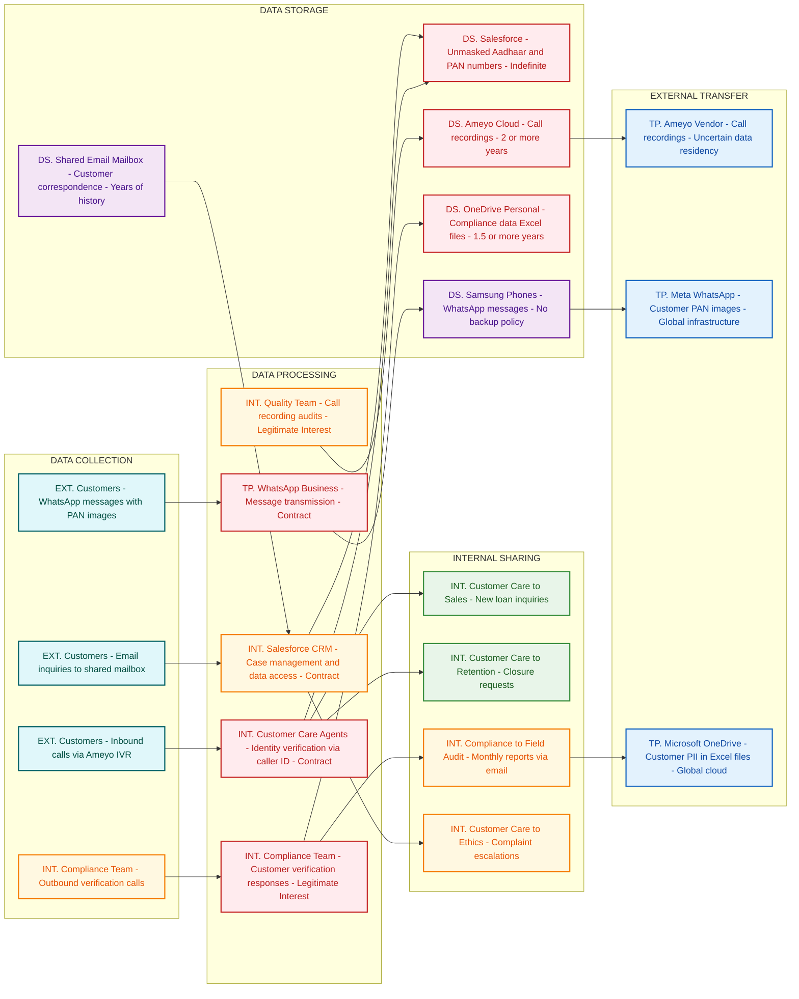

# Privacy Data Flow Diagram
## Customer Care Department

## Section 1: Mermaid Privacy DFD

## Section 2: Privacy Data Mapping and Inventory Table

| S.No | Data Category | Description | Purpose | Legal Basis | Data Owner | Storage Location | Data Classification | Retention Period | Legal Obligation | Risk Level |
|------|--------------|-------------|---------|-------------|-----------|-----------------|--------------------|-----------------|--------------------|------------|
| 1 | Aadhaar Numbers | Primary and co-applicant Aadhaar numbers visible unmasked to all 45 Customer Care staff | Customer identity verification | Contract | Customer Care Department | Salesforce CRM | Sensitive PII | Indefinite | Aadhaar Act compliance required | HIGH |
| 2 | PAN Numbers | Primary and co-applicant PAN numbers fully visible without masking | Tax identification and KYC | Contract | Customer Care Department | Salesforce CRM | Sensitive PII | Indefinite | IT Act compliance | HIGH |
| 3 | Financial Data | Loan amounts, EMI details, outstanding balances, payment history | Customer service and account management | Contract | Customer Care Department | Salesforce CRM | Sensitive PII | Indefinite | RBI guidelines | HIGH |
| 4 | Call Recordings | All inbound and outbound calls recorded with personal and financial discussions | Quality monitoring and compliance | Legitimate Interest | Customer Care Department | Ameyo Cloud Storage | Sensitive PII | 2 or more years | No explicit consent | HIGH |
| 5 | WhatsApp Messages | Customer communications including PAN card images and sensitive queries | Customer support via messaging | Contract | Customer Care Department | Samsung Phones | Sensitive PII | No backup policy | DPDPA compliance | HIGH |
| 6 | Email Communications | Customer inquiries and support correspondence | Customer service via email channel | Contract | Customer Care Department | Shared Email Mailbox | PII | Years of history | No retention policy | MEDIUM |
| 7 | Compliance Call Data | Customer verification responses and fraud-related information | Pre and post-disbursement verification | Legitimate Interest | Compliance Team | OneDrive Personal | Sensitive PII | 1.5 or more years | No succession plan | HIGH |
| 8 | Case Management Data | Customer complaints including bribery allegations and health information | Complaint resolution and escalation | Contract | Customer Care Department | Salesforce CRM | Sensitive PII | Indefinite | Ethics compliance | HIGH |
| 9 | Customer Profile Data | Complete customer records including co-applicant details and branch information | Customer identification and service delivery | Contract | Customer Care Department | Salesforce CRM | Sensitive PII | Indefinite | KYC requirements | HIGH |
| 10 | Quality Audit Data | Call performance scores with customer identifiers | Agent performance evaluation | Legitimate Interest | Quality Team | Excel files | PII | Unknown | No data minimization | MEDIUM |

## Section 3: Privacy Risk Summary

**Risk 1: Unauthorized Aadhaar Data Exposure**
- Affected data subjects: All customers and co-applicants with loans
- Risk description: Full Aadhaar numbers of primary and co-applicants are displayed unmasked to all 45 Customer Care staff members without role-based restrictions, violating Aadhaar Act provisions requiring restricted access and masking
- Applicable regulation: Aadhaar Act 2016, DPDPA 2023
- Recommended control: Implement Aadhaar number masking showing only last 4 digits and role-based access controls

**Risk 2: Inadequate Customer Authentication**
- Affected data subjects: All customers calling for support
- Risk description: Customer identity verification relies solely on caller ID matching without additional authentication factors, enabling unauthorized access to complete financial profiles by anyone using customer mobile devices
- Applicable regulation: DPDPA 2023, RBI guidelines
- Recommended control: Implement multi-factor authentication including security questions or OTP verification

**Risk 3: Cross-Border Data Transfer Without Safeguards**
- Affected data subjects: Customers using WhatsApp support and those whose calls are recorded
- Risk description: Customer PAN images and financial data are processed through WhatsApp's global infrastructure and Ameyo's uncertain data residency without adequate transfer impact assessments or safeguards
- Applicable regulation: DPDPA 2023 cross-border transfer provisions
- Recommended control: Conduct Transfer Impact Assessment and implement Standard Contractual Clauses or migrate to domestic alternatives

**Risk 4: Mass Data Exfiltration Capability**
- Affected data subjects: All customers in the database
- Risk description: Team Leads and Managers can export entire customer database including PAN, Aadhaar, and financial data to local CSV files without data loss prevention controls or audit trails
- Applicable regulation: DPDPA 2023 data minimization and security requirements
- Recommended control: Implement data loss prevention controls, audit logging, and restrict bulk export capabilities

**Risk 5: Indefinite Data Retention Without Policy**
- Affected data subjects: All customers who have called or emailed
- Risk description: Call recordings are stored for 2+ years and email correspondence is retained indefinitely without documented retention policies or automated deletion procedures, violating storage limitation principles
- Applicable regulation: DPDPA 2023 storage limitation requirements
- Recommended control: Establish data retention policy with automated deletion schedules and business justification for retention periods

**Risk 6: Unencrypted Sensitive Data Transmission**
- Affected data subjects: Customers whose data is shared in compliance reports
- Risk description: Customer PII, loan account numbers, and fraud-related responses are transmitted via unencrypted email attachments to Field Audit and Anti-Fraud teams
- Applicable regulation: DPDPA 2023 data security requirements, ISO 27001
- Recommended control: Implement encrypted email solutions or secure file transfer protocols for sensitive data sharing