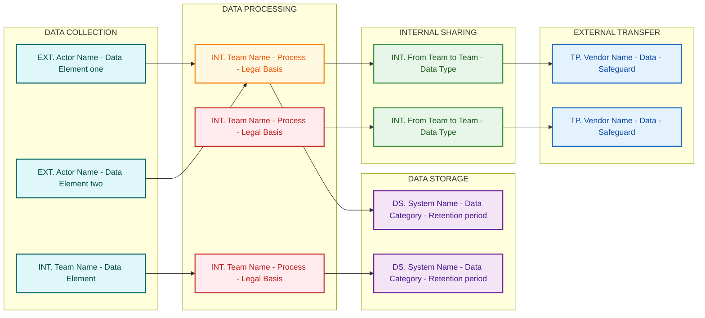

# Mermaid 8.8.0 Compatibility Rules for Privacy DFDs

## Required Syntax

| Element | Required | Notes |
|---------|----------|-------|
| Graph type | `graph LR` only | NEVER `flowchart` |
| Subgraph label | `subgraph ID["Plain text"]` | No emojis, no special chars |
| Subgraph direction | Omit entirely | `direction TB` breaks 8.8.0 |

---

## Node Shape Rules

**ALL nodes MUST use plain rectangles only:**
```
NodeID["Label Text"]
```

| ❌ BANNED | ✅ Use Instead |
|-----------|---------------|
| `id[(Database)]` cylinder | `id["Label"]` rectangle |
| `id[/Process/]` parallelogram | `id["Label"]` rectangle |
| `id([Round])` stadium | `id["Label"]` rectangle |
| `id((Circle))` circle | `id["Label"]` rectangle |

Use **classDef color** to visually distinguish node types, not shape.

---

## Label Text Rules — Characters Allowed Inside `"..."`

| Rule | ❌ Bad | ✅ Good |
|------|-------|--------|
| No square brackets | `"[EXT] Name"` | `"EXT. Name"` |
| No parentheses | `"Meta (WhatsApp)"` | `"Meta WhatsApp"` |
| No colon | `"System: Data"` | `"System - Data"` |
| No plus sign | `"2+ years"` | `"2 or more years"` |
| No ampersand | `"Ethics & Compliance"` | `"Ethics and Compliance"` |
| No slash in text | `"PII/Sensitive"` | `"PII or Sensitive"` |
| No arrow chars | `"Dept → Dept"` | `"Dept to Dept"` |
| No emojis | `"📥 Collection"` | `"DATA COLLECTION"` |
| No quotes inside | `"text "quoted" text"` | Avoid nested quotes |

**SAFE characters inside labels:** Letters, numbers, spaces, hyphens `-`, periods `.`, commas `,`

### Node Type Prefix Convention

Use a period-suffix prefix (NO square brackets):

| Type | Prefix | Example |
|------|--------|---------|
| External actor | `EXT.` | `"EXT. Customers - Voice calls"` |
| Internal team | `INT.` | `"INT. Customer Care - Identity verification"` |
| Data store | `DS.` | `"DS. Salesforce - PII Data - Indefinite"` |
| Third-party vendor | `TP.` | `"TP. Ameyo Vendor - Call recordings"` |

---

## Connection Rules

| Usage | ✅ Correct Syntax |
|-------|-----------------|
| Node to node (same subgraph) | `C1 --> P1` |
| Node to node (cross-subgraph) | `C1 --> P1` |
| Labeled connection | `C1 -->|"sends data"| P1` |

> **IMPORTANT:** Connect INDIVIDUAL NODES across subgraphs — NOT subgraph IDs.
> `COLLECTION --> PROCESSING` ❌ — subgraph-to-subgraph ID connections are unreliable in 8.8.0.
> Instead: `C2 --> P1` ✅ (last collection node → first processing node)

---

## ClassDef Color Convention

```text
classDef highRisk fill:#ffebee,stroke:#c62828,stroke-width:2px,color:#b71c1c
classDef medRisk  fill:#fff8e1,stroke:#f57c00,stroke-width:2px,color:#e65100
classDef lowRisk  fill:#e8f5e9,stroke:#388e3c,stroke-width:2px,color:#1b5e20
classDef dataStore fill:#f3e5f5,stroke:#6a1b9a,stroke-width:2px,color:#4a148c
classDef extTransfer fill:#e3f2fd,stroke:#1565c0,stroke-width:2px,color:#0d47a1
classDef collection fill:#e0f7fa,stroke:#006064,stroke-width:2px,color:#004d40
```

| Class | Color | Meaning |
|-------|-------|---------|
| `collection` | Teal | External actors and data sources |
| `highRisk` | Red | High-risk data elements |
| `medRisk` | Amber | Medium-risk elements |
| `lowRisk` | Green | Low-risk or informational |
| `dataStore` | Purple | Internal storage systems |
| `extTransfer` | Blue | External third-party transfers |

---

## Complete Valid Template


